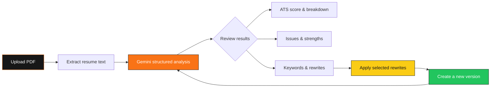

<div align="center">

<a href="https://github.com/abhishekxxch/HireLens">
	
</a>

<p><strong>AI-powered resume analysis for sharper applications.</strong><br />Upload a PDF, see what an ATS sees, and turn every weak bullet into a stronger story.</p>

<p>
	<a href="#-what-it-does"></a>
	<a href="#-getting-started"></a>
	
</p>

<br />


</div>

## ✦ What it does

HireLens is a full-stack AI resume coach built for the part after “upload resume” and before “send application.” It combines ATS scoring, structured feedback, keyword intelligence, and version history in one focused workspace.

<table>
<tr>
<td width="50%">

### 🔥 Roast the resume

Drop in a PDF and get an ATS score, category breakdown, actionable issues, strengths, and a concise analysis summary.

</td>
<td width="50%">

### ✍️ Rewrite the signal

Review AI-generated bullet rewrites, select the improvements that fit, and apply them as a new resume version.

</td>
</tr>
<tr>
<td width="50%">

### 📈 Track the climb

See score evolution, activity, version deltas, and the exact changes that move an application forward.

</td>
<td width="50%">

### 🧠 Find what is missing

Surface present and missing keywords so your resume speaks the language of the role and the ATS.

</td>
</tr>
</table>

## ⚡ The experience

```text
PDF upload  ──▶  text extraction  ──▶  Gemini analysis  ──▶  score + insights
		 ▲                                                        │
		 └────────────── version history ◀── selected rewrites ◀──┘
```



## 🧩 Built with

| Layer | Tools |
| --- | --- |
| Client | React 19, Vite, Tailwind CSS, React Router, TanStack Query |
| Interaction | Framer Motion, Lucide, Recharts, React Dropzone |
| Server | Node.js 20+, Express 5, Multer, Zod |
| Intelligence | Google Gemini via `@google/genai` |
| Data | MongoDB with Mongoose |
| Documents | `pdf-parse`, `@react-pdf/renderer` |

## 🚀 Getting started

### 1. Clone and install

```bash
git clone https://github.com/abhishekxxch/HireLens.git
cd hirelens

cd Backend
npm install

cd ../Frontend/prj_UI
npm install
```

### 2. Configure the API

Create `Backend/.env`:

```env
NODE_ENV=development
PORT=5000
MONGO_URI=mongodb://127.0.0.1:27017/hirelens
JWT_SECRET=replace-with-a-long-random-secret
JWT_EXPIRES_IN=7d
COOKIE_NAME=hirelens_token
CLIENT_ORIGIN=http://localhost:5173
GEMINI_API_KEY=your-gemini-api-key
GEMINI_MODEL=gemini-3.5-flash-lite
```

`MONGO_URI` and `JWT_SECRET` are required for production. The Gemini key is required when running AI analysis.

### 3. Run both apps

In terminal one:

```bash
cd Backend
npm run dev
```

In terminal two:

```bash
cd Frontend/prj_UI
npm run dev
```

Open [http://localhost:5173](http://localhost:5173). The Vite dev server proxies `/api` requests to the backend at `http://localhost:5000`.

<details>
<summary><strong>Available scripts</strong></summary>

**Frontend**

| Command | Purpose |
| --- | --- |
| `npm run dev` | Start the Vite development server |
| `npm run build` | Build the production bundle |
| `npm run lint` | Run ESLint |
| `npm run preview` | Preview the production bundle |

**Backend**

| Command | Purpose |
| --- | --- |
| `npm run dev` | Start the API with Nodemon |
| `npm start` | Start the API with Node |
| `npm run seed` | Run the seed script |

</details>

## 🗺️ Project map

```text
HireLens/
├── Backend/
│   └── src/
│       ├── routes/       # Auth, resumes, dashboard, insights, history, versions
│       ├── services/     # Gemini, PDF extraction, parsing, diffing
│       ├── models/       # User, resume, analysis, and version schemas
│       └── middleware/   # Auth, uploads, validation, rate limits, errors
└── Frontend/prj_UI/
		└── src/
				├── pages/        # Landing, dashboard, analysis, history, export
				├── components/   # Analysis, resume, dashboard, auth, and layout UI
				├── api/          # Axios API modules
				└── hooks/        # Query-backed data hooks
```

## 🔐 API surface

| Area | Route family | Purpose |
| --- | --- | --- |
| Health | `/api/health` | Service health check |
| Auth | `/api/auth` | Registration, login, session management |
| Resumes | `/api/resumes` | Upload, analyze, inspect, and delete resumes |
| Dashboard | `/api/dashboard` | Scores, activity, and resume overview |
| Insights | `/api/insights` | Aggregated resume intelligence |
| History | `/api/history` | Analysis activity history |
| Versions | `/api/versions` | Cross-resume version tracking |

## 🌱 Contributing

Small, focused improvements are welcome. Create a branch, make the change, run the frontend lint/build checks, and open a pull request with the reasoning and verification steps.

```bash
git checkout -b feat/your-improvement
git add .
git commit -m "feat: describe your improvement"
git push origin feat/your-improvement
```

<div align="center">

### Make the next application easier to say yes to.

<a href="#-getting-started"></a>

<br /><br />


</div>